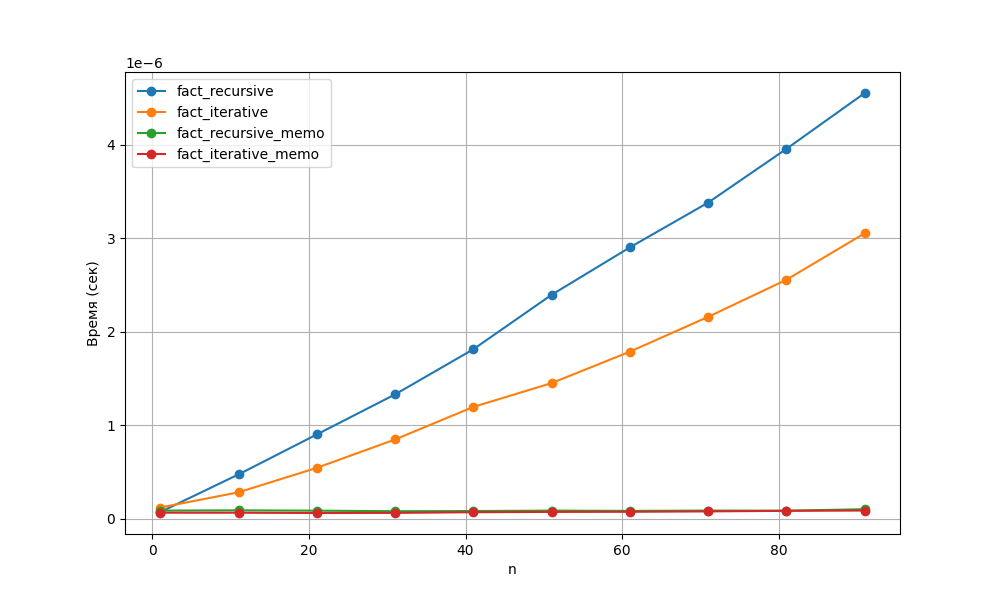

## ЛР-5

### Задание
0. Изучить материал про мемоизацию и реализовать сравнение мемоизованных и немемоизованных вариантов функций (рекурсивной и нерекурсивной). Проанализировать результаты и сделать выводы, описать выводы в отчете, построить графики.

1. Код программы:

```py
import functools

def fact_recursive(n):
    """Вычисляет факториал числа n рекурсивным методом.
    Args:
        n (int): Неотрицательное целое число.
    Returns:
        int: Факториал числа n.
    Raises:
        RecursionError: Если n превышает максимальную глубину рекурсии.
    """
    return 1 if n <= 1 else n * fact_recursive(n - 1)


def fact_iterative(n):
    """Вычисляет факториал числа n итеративным методом.
    Args:
        n (int): Неотрицательное целое число.
    Returns:
        int: Факториал числа n.
    """
    result = 1
    for i in range(2, n + 1):
        result *= i
    return result


cache = {0: 1, 1: 1}

def fact_recursive_memo(n):
    """Вычисляет факториал числа n рекурсивным методом с мемоизацией.
    Использует глобальный словарь cache для хранения ранее вычисленных значений.
    Args:
        n (int): Неотрицательное целое число.
    Returns:
        int: Факториал числа n.
    """
    if n not in cache:
        cache[n] = n * fact_recursive_memo(n - 1)
    return cache[n]


@functools.lru_cache(maxsize=None)
def fact_iterative_memo(n):
    """Вычисляет факториал числа n итеративным методом с кешированием.
    Использует декоратор lru_cache для автоматического кеширования результатов.
    Args:
        n (int): Неотрицательное целое число.
    Returns:
        int: Факториал числа n.
    """
    result = 1
    for i in range(2, n + 1):
        result *= i
    return result
```

```py
import timeit
import matplotlib.pyplot as plt
from factorial import *

nums = list(range(1, 101, 10))

funcs = [
    ("Рекурсивная", fact_recursive),
    ("Итеративная", fact_iterative), 
    ("Рекурсивная+мемо", fact_recursive_memo),
    ("Итеративная+кеш", fact_iterative_memo)
]


results = {}
for name, func in funcs:
    times = []
    for n in nums:
        t = timeit.timeit(lambda: func(n), number=100) / 100
        times.append(t)
    results[name] = times

plt.figure(figsize=(10,6))
for name, times in results.items():
    plt.plot(nums, times, marker='o', label=name)

plt.xlabel('n')
plt.ylabel('Время (сек)')
plt.legend()
plt.grid(True)
plt.savefig('benchmark.png')
plt.show()

print("Чистый бенчмарк (n=50, один вызов):")
for name, func in funcs:
    start = timeit.default_timer()
    func(50)
    end = timeit.default_timer()
    print(f"{name}: {end-start:.6f} сек")
```
```

2. Результат выполненной работы:  


---